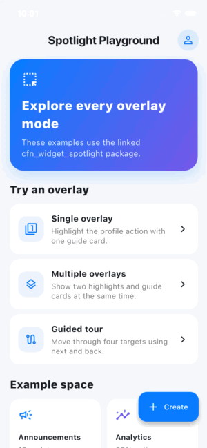

# cfn_widget_spotlight

Customizable spotlight overlays and guided tours for Flutter. The package can
highlight one widget, multiple widgets at the same time, or a sequence of
single/multi-target steps.

## Demo



## Features

- Sharp cutouts over a dimmed, blurred backdrop
- Rectangle, rounded rectangle, circle, and oval highlights
- Automatic or explicit card placement on any side of a target
- Single-target and simultaneous multi-target overlays
- Multi-step tours with progress, next, back, done, and skip controls
- Completely custom card widgets through `contentBuilder`
- Configurable colors, typography, spacing, elevation, pointer, and animation
- Optional interaction with the highlighted widget
- Barrier dismissal, completion results, callbacks, and controller API
- Accessibility route and target semantics

## Installation

Add the package from pub.dev:

```shell
flutter pub add cfn_widget_spotlight
```

Or add it manually:

```yaml
dependencies:
  cfn_widget_spotlight: ^0.0.3
```

Then import it:

```dart
import 'package:cfn_widget_spotlight/cfn_widget_spotlight.dart';
```

## Single spotlight

Give the widget being highlighted a `GlobalKey`, then show the overlay after
the widget is mounted.

```dart
final editProfileKey = GlobalKey();

ElevatedButton(
  key: editProfileKey,
  onPressed: editProfile,
  child: const Text('Edit Profile'),
);

await CfnWidgetSpotlight.show(
  context,
  target: SpotlightTarget(
    key: editProfileKey,
    title: 'Personalize Your Profile',
    description:
        'Update your profile details and choose what to share.',
    placement: SpotlightPlacement.below,
    nextLabel: 'Continue to Publish',
  ),
);
```

## Multiple simultaneous overlays

One step can contain several cutouts and cards. Set `showNavigation: false`
for informational cards so only the primary card shows controls.

```dart
await CfnWidgetSpotlight.showMultiple(
  context,
  targets: [
    SpotlightTarget(
      key: announcementsTabKey,
      title: 'Announcement',
      description: 'Stay informed and share updates.',
      showNavigation: false,
      placement: SpotlightPlacement.below,
    ),
    SpotlightTarget(
      key: announcementButtonKey,
      title: 'Keep Members Updated',
      description: 'Share updates, events, insights, and important notices.',
      placement: SpotlightPlacement.above,
    ),
  ],
);
```

## Multi-step tour

Each `SpotlightStep` may contain one or many targets.

```dart
final controller = SpotlightController();

final result = await CfnWidgetSpotlight.showTour(
  context,
  controller: controller,
  steps: [
    SpotlightStep.single(
      SpotlightTarget(
        key: profileKey,
        title: 'Your profile',
        description: 'Introduce yourself to the community.',
      ),
    ),
    SpotlightStep(
      targets: [
        SpotlightTarget(
          key: bioKey,
          title: 'Bio',
          showNavigation: false,
        ),
        SpotlightTarget(
          key: linksKey,
          title: 'Links',
          description: 'Add your creative presence.',
        ),
      ],
    ),
  ],
  onStepChanged: (index) => debugPrint('Showing step $index'),
);

if (result.completed) {
  // Persist that onboarding has been completed.
}
```

The controller also supports `next()`, `previous()`, `goTo(index)`, `skip()`,
and `dismiss()`.

## Custom content

`contentBuilder` replaces the default card. Its details provide the controller,
tour progress, target progress, and measured target rectangle.

```dart
SpotlightTarget(
  key: targetKey,
  placement: SpotlightPlacement.auto,
  shape: SpotlightShape.circle,
  contentBuilder: (context, details) {
    return Card(
      color: Colors.indigo,
      child: Padding(
        padding: const EdgeInsets.all(20),
        child: Column(
          mainAxisSize: MainAxisSize.min,
          children: [
            const Text('Your custom content'),
            FilledButton(
              onPressed: details.controller.next,
              child: const Text('Continue'),
            ),
          ],
        ),
      ),
    );
  },
);
```

## Styling

Pass `SpotlightThemeData` to any show method. `copyWith` is available when only
a few defaults need changing.

```dart
final spotlightTheme = const SpotlightThemeData().copyWith(
  barrierColor: Colors.black.withValues(alpha: 0.62),
  blurSigma: 4,
  primaryColor: Colors.deepPurple,
  highlightBorderColor: Colors.white,
  cardBorderRadius: BorderRadius.circular(28),
  animationDuration: const Duration(milliseconds: 300),
);

await CfnWidgetSpotlight.show(
  context,
  target: target,
  theme: spotlightTheme,
  barrierDismissible: true,
);
```

Per-target customization includes placement, alignment, shape, padding, border
radius, card gap/offset, maximum width, pointer visibility, labels, semantics,
and target interaction.

### Per-target card and button styling

Customize the default card without rebuilding its content:

```dart
SpotlightTarget(
  key: targetKey,
  title: 'Custom appearance',
  description: 'The standard content with your own visual design.',
  cardColor: const Color(0xFF171B2E),
  cardBorderRadius: BorderRadius.circular(32),
  cardPadding: const EdgeInsets.all(24),
  cardElevation: 18,
  titleStyle: const TextStyle(
    color: Colors.white,
    fontSize: 20,
    fontWeight: FontWeight.bold,
  ),
  descriptionStyle: const TextStyle(color: Colors.white70),
  primaryButtonStyle: FilledButton.styleFrom(
    backgroundColor: Colors.orange,
    foregroundColor: Colors.black,
    padding: const EdgeInsets.symmetric(horizontal: 24, vertical: 16),
    shape: RoundedRectangleBorder(
      borderRadius: BorderRadius.circular(14),
    ),
  ),
);
```

Use `navigationBuilder` when the progress label and buttons need completely
custom widgets:

```dart
SpotlightTarget(
  key: targetKey,
  title: 'Custom navigation',
  navigationBuilder: (context, navigation) {
    return Row(
      children: [
        Text(navigation.progressLabel),
        const Spacer(),
        if (navigation.canGoBack)
          IconButton(
            onPressed: navigation.back,
            icon: const Icon(Icons.chevron_left),
          ),
        IconButton(
          onPressed: navigation.next,
          icon: const Icon(Icons.chevron_right),
        ),
      ],
    );
  },
);
```

Set `primaryButtonStyle` and `secondaryButtonStyle` on
`SpotlightThemeData` to apply button styling to the entire tour. Use
`contentBuilder` when the complete card layout should be replaced.

### Rich content while the keyboard is open

Cards avoid the software keyboard by default. Use `bodyBuilder` for rich rows
while keeping the standard card, progress, and navigation controls:

```dart
SpotlightTarget(
  key: sentimentKey,
  title: "What's your outlook?",
  placement: SpotlightPlacement.below,
  cardBorderRadius: BorderRadius.circular(24),
  bodyBuilder: (context, details) => const Column(
    mainAxisSize: MainAxisSize.min,
    children: [
      ListTile(
        dense: true,
        contentPadding: EdgeInsets.zero,
        leading: CircleAvatar(
          backgroundColor: Colors.green,
          child: Icon(Icons.trending_up, color: Colors.white),
        ),
        title: Text('Bullish'),
        subtitle: Text('Price will go up'),
      ),
      ListTile(
        dense: true,
        contentPadding: EdgeInsets.zero,
        leading: CircleAvatar(
          backgroundColor: Colors.red,
          child: Icon(Icons.trending_down, color: Colors.white),
        ),
        title: Text('Bearish'),
        subtitle: Text('Price will go down'),
      ),
      ListTile(
        dense: true,
        contentPadding: EdgeInsets.zero,
        leading: CircleAvatar(
          backgroundColor: Colors.orange,
          child: Icon(Icons.horizontal_rule, color: Colors.white),
        ),
        title: Text('Neutral'),
        subtitle: Text('Price will stay within a range'),
      ),
    ],
  ),
);
```

Set `avoidKeyboard: false` on `SpotlightThemeData` only when guide cards are
intentionally allowed behind the keyboard.

## Target interaction

Set `allowTargetInteraction: true` to let taps inside the cutout reach the
original widget. Alternatively, set `onTargetTap` to handle that region in the
overlay itself.

The `GlobalKey` target must be mounted and laid out when its step is displayed.
For targets inside a scroll view, scroll the target into view before advancing
to its step.
